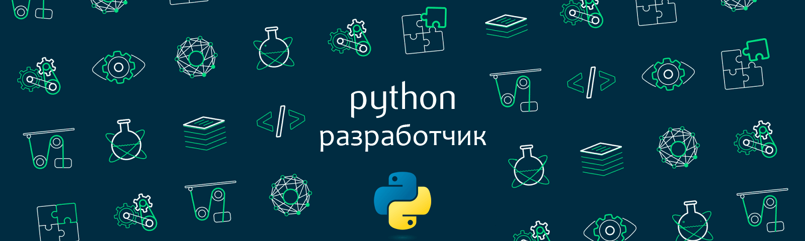
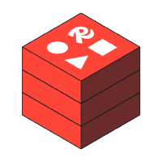

<h1 align="center">Эдуард Татарников </h1>

 Я Backend-разработчик на Python.  
Мне нравится писать код на Python и я постоянно учусь делать это лучше! 😎

<h3 align="left">💡 Технлогии и Инструменты:</h3>

<!--
Основной стек: Python • SOLID • GIT • GitHub • Django • Django Rest Framework • REST API • PostgreSQL • SQLite • SQLAlchemy • AsyncPG • SQL • Redis • Asyncio • Pytest • CI/CD • Linux • Docker • Celery • Nginx • Djoser • Typing • Loguru • ImageKit • Social_django • Aiocron • tqdm
-->

<h3 align="left">👨‍💻 Мои работы:</h3>

 

  
Проекты

   <ul>
    <li><a href="https://github.com/Edmaroff/retail-order-api">API-сервис заказа товаров для розничных сетей</a></li>
     

      
Описание

       <b>&nbsp;&nbsp;&nbsp;&nbsp;Задача:</b>
        <ul><ul>
         <li>Разработать backend-часть для автоматизации процессов закупок и продаж в розничной торговой сети.</li>
        </ul></ul>
       <b>&nbsp;&nbsp;&nbsp;&nbsp;Результаты:</b>
        <ul><ul>
         <li>Реализовал регистрацию пользователей через Djoser с JWT аутентификацией, включая поддержку OAuth авторизации через Google и GitHub с помощью social_django;</li>
         <li>Добавил функционал управления корзиной, контактами покупателей и создания заказов с поддержкой товаров из нескольких магазинов;</li>
         <li>Реализовал управление магазинами и товарами для продавцов, включая асинхронный импорт/экспорт товаров с использованием Celery и Redis, а также обработку изображений с Imagekit;</li>
         <li>Настроил автоматическое тестирование и линтинг с flake8 через GitHub Actions, включая покрытие кода тестами Pytest и интеграцию с PostgreSQL;</li>
         <li>Подключил документацию API с помощью drf-spectacular и подготовил коллекцию Postman для тестирования;</li>
         <li>Улучшил административный интерфейс с помощью django-baton;</li>
         <li>Реализовал развертывание проекта через Docker Compose с использованием Nginx.</li>
        </ul></ul>
       <b>&nbsp;&nbsp;&nbsp;&nbsp;<u>Используемые технологии:</u></b>
        <ul><ul>
         <li>Python, Django, Django REST Framework, Celery, Redis, Djoser, Docker, social_django, Imagekit, Pytest, drf-spectacular, django-baton, Nginx.</li>
        </ul></ul>&nbsp;
     

    <li><a href="https://github.com/Edmaroff/mailing-service">API-сервис рассылок</a></li> 
     

      
Описание

       <b>&nbsp;&nbsp;&nbsp;&nbsp;<u>Задача:</u></b>
        <ul><ul>
         <li>Разработать API для управления рассылками с функцией автоматического запуска сообщений клиентам по заданным фильтрам и времени.</li>
        </ul></ul>
       <b>&nbsp;&nbsp;&nbsp;&nbsp;<u>Результаты:</u></b>
        <ul><ul>
         <li>Реализовал REST API для создания, просмотра и управления рассылками на основе Django REST Framework;</li>
         <li>Добавил фильтрацию клиентов по коду оператора и тегам для отправки сообщений;</li>
         <li>Реализовал автоматический запуск рассылок по расписанию с учетом времени начала и окончания рассылки с Celery;</li>
         <li>Настроил асинхронную отправку сообщений через Celery и Redis;</li>
         <li>Сделал мониторинг задач рассылки через Flower;</li>
         <li>Подготовил фикстуры с тестовыми данными и коллекцию Postman для тестирования API.;</li>
         <li>Реализовал запуск проекта с использованием Docker Compose.</li>
        </ul></ul>
       <b>&nbsp;&nbsp;&nbsp;&nbsp;<u>Используемые технологии:</u></b>
        <ul><ul>
         <li>Python, Django REST framework, PostgreSQL, Celery, Redis, Docker, Flower, Postman.</li>
        </ul></ul>&nbsp;
     

    <li><a href="https://github.com/Edmaroff/database-tatto-bot">Система управления данными для тату-мастеров и клиентов</a></li> 
     

      
Описание

       <b>&nbsp;&nbsp;&nbsp;&nbsp;<u>Задача:</u></b>
        <ul><ul>
         <li>Разработать асинхронную систему управления данными для взаимодействия тату-мастеров и клиентов.</li>
        </ul></ul>
       <b>&nbsp;&nbsp;&nbsp;&nbsp;<u>Результаты:</u></b>
        <ul><ul>
         <li>Спроектировал структуру БД PostgreSQL для хранения профилей мастеров, клиентов, стилей тату, лайков и жалоб;</li>
         <li>Реализовал набор асинхронных функций для работы с БД, включая поиск и ранжирование анкет мастеров с использованием SQLAlchemy, AsyncPG и Asyncio;</li>
         <li>Разработал функции для генерации фейковых профилей мастеров и сбора статистики для администраторов;</li>
         <li>Сделал типизацию и логирование с Typing и Loguru.</li>
         <li>Обеспечил обработку ошибок и логирование для облегчения отладки и мониторинга.</li>
        </ul></ul>
       <b>&nbsp;&nbsp;&nbsp;&nbsp;<u>Используемые технологии:</u></b>
        <ul><ul>
         <li>Python, PostgreSQL, SQLAlchemy, AsyncPG, Asyncio, Loguru, Typing.</li>
        </ul></ul>&nbsp;
     

    <li><a href="https://github.com/Edmaroff/product-shop-api">API-сервис для интернет-магазина</a></li> 
     

      
Описание

       <b>&nbsp;&nbsp;&nbsp;&nbsp;<u>Задача:</u></b>
        <ul><ul>
         <li>Разработать API для интернет-магазина продуктов на Django Rest Framework.</li>
        </ul></ul>
       <b>&nbsp;&nbsp;&nbsp;&nbsp;<u>Результаты:</u></b>
        <ul><ul>
         <li>Реализовал управление категориями и подкатегориями товаров с полями: наименование, slug и изображение, включая эндпоинты для вывода данных с пагинацией;</li>
         <li>Создал функционал корзины, включая добавление, изменение и удаление товаров, а также подсчет общей стоимости;</li>
         <li>Настроил JWT-аутентификацию, обеспечив безопасный доступ к корзине пользователей;</li>
         <li>Оптимизировал обработку изображений продуктов, добавив автоматическое создание миниатюр с Imagekit;</li>
         <li>Настроил фикстуры для загрузки начальных данных в PostgreSQL и подключил Swagger UI для автоматической документации API;</li>
         <li>Покрыл тестами ключевые методы с использованием Pytest.</li>
        </ul></ul>
       <b>&nbsp;&nbsp;&nbsp;&nbsp;<u>Используемые технологии:</u></b>
        <ul><ul>
         <li>Python, Django REST framework,PostgreSQL, drf-spectacular, Imagekit, Pytest.</li>
        </ul></ul>&nbsp;
     

    <li><a href="https://github.com/Edmaroff/fix-price-parser">Парсер Fix Price</a></li> 
     

      
Описание

       <b>&nbsp;&nbsp;&nbsp;&nbsp;<u>Задача:</u></b>
        <ul><ul>
         <li>Разработать программу для сбора данных о товарах интернет-магазина Fix Price с учетом региональных особенностей.</li>
        </ul></ul>
       <b>&nbsp;&nbsp;&nbsp;&nbsp;<u>Результаты:</u></b>
        <ul><ul>
         <li>Реализовал сбор данных о товарах, включая название, цену, скидки и наличие, с обработкой пагинации и региональных настроек;</li>
         <li>Добавил поддержку прокси-серверов для увеличения устойчивости работы парсера;</li>
         <li>Организовал сохранение данных в JSON-формате с заданной структурой для дальнейшей обработки;</li>
         <li>Обработал возможные ошибки и исключения для стабильной работы парсера;</li>
         <li>Реализовал запуск через docker-compose.</li>
        </ul></ul>
       <b>&nbsp;&nbsp;&nbsp;&nbsp;<u>Используемые технологии:</u></b>
        <ul><ul>
         <li>Python, Scrapy, Docker.</li>
        </ul></ul>&nbsp;
     

    <li><a href="https://github.com/Edmaroff/database-marketing-bot/">Система управления данными для маркетинга</a></li> 
     

      
Описание

       <b>&nbsp;&nbsp;&nbsp;&nbsp;<u>Задача:</u></b>
        <ul><ul>
         <li>Разработать асинхронную систему управления реферальной программой с использованием реляционной базы данных.</li>
        </ul></ul>
       <b>&nbsp;&nbsp;&nbsp;&nbsp;<u>Результаты:</u></b>
        <ul><ul>
         <li>Спроектировал структуру БД для пользователей, реферальных связей и контент-плана;</li>
         <li>Интегрировал асинхронный драйвер AsyncPG и интерфейсы SQLAlchemy для взаимодействия с PostgreSQL;</li>
         <li>Разработал асинхронные функции для CRUD операций с помощью Asyncio;</li>
         <li>Реализовал асинхронный механизм персонализированной рассылки сообщений рефералам по контент-плану с Aiocron;</li>
         <li>Внедрил типизацию с Typing и логирование с Loguru;</li>
         <li>Обеспечил обработку ошибок и логирование для облегчения отладки и мониторинга.</li>
        </ul></ul>
       <b>&nbsp;&nbsp;&nbsp;&nbsp;<u>Используемые технологии:</u></b>
        <ul><ul>
         <li>Python, PostgreSQL, SQLAlchemy, AsyncPG, Asyncio, Loguru, Typing.</li>
        </ul></ul>&nbsp;
     

    <li><a href="https://github.com/Edmaroff/library-manager">Менеджер библиотеки</a></li> 
     

      
Описание

       <b>&nbsp;&nbsp;&nbsp;&nbsp;<u>Задача:</u></b>
        <ul><ul>
         <li>Разработать консольное приложение для управления библиотекой книг без использования сторонних библиотек.</li>
        </ul></ul>
       <b>&nbsp;&nbsp;&nbsp;&nbsp;<u>Результаты:</u></b>
        <ul><ul>
         <li>Разработал модульную и масштабируемую архитектуру приложения с использованием принципов ООП, включая разделение на слои: модели данных, бизнес-логику, управление данными и пользовательский интерфейс;</li>
         <li>Реализовал основные функции: добавление, удаление, поиск, отображение и изменение статуса книг;</li>
         <li>Обеспечил хранение данных в формате JSON с поддержкой долговременного сохранения и восстановления информации;</li>
         <li>Реализовал обработку ошибок и исключений для предотвращения сбоев при некорректном вводе;</li>
         <li>Написал модульные тесты для проверки всех ключевых функций приложения c Pytest.</li>
        </ul></ul>
       <b>&nbsp;&nbsp;&nbsp;&nbsp;<u>Используемые технологии:</u></b>
        <ul><ul>
         <li>Python, Pytest.</li>
        </ul></ul>&nbsp;
     

   </ul>
 

<h3 align="left">📞 Связаться со мной:</h3>

 
 
 

 
<h3 align="left">📈 GitHub:</h3>
<table>
  <tr>
    <td>
      
    </td>
    <td>
      
    </td>
  </tr>
</table>

<!-- ---

<h3 align="left">  Codewars:</h3>
 -->

