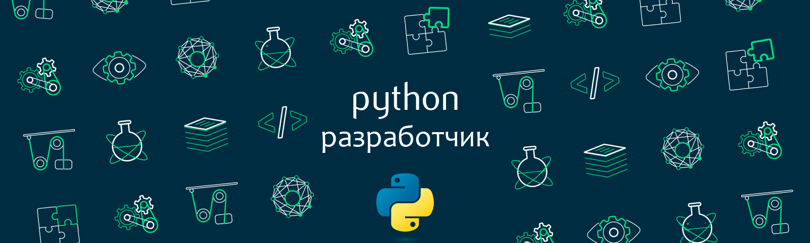

<h1 align="center">Эдуард Татарников </h1>

 Я Эдуард, начинающий Backend-разработчик на Python.  
Мне нравится писать код на Python и я постоянно учусь это делать лучше! 😎

---
<h3 align="left">💡 Технлогии и Инструменты:</h3>

 

---
<h3 align="left">👨‍🎓 Пройденные курсы:</h3>

| Ссылка                                                                  |Название                                                        | Дата              |
| --------------------------------                                        |----------------------------------------------------------------| :---------------: |
|[skillbox.ru](https://skillbox.ru/course/programming-introduction-free/) |Введение в программирование                                     | 05/2022 - 05/2022 |
|[letpy.com](https://letpy.com/)                                          |Основы программирования на языке Python                         | 05/2022 - 06/2022 |
|[netology.ru](https://netology.ru/programs/python)                       |Python-разработчик с нуля                                       | 06/2022 - xx/2023 |
|[stepik.org](https://stepik.org/course/116336/promo)                     |Добрый, добрый Python ООП - обучающий курс от Сергея Балакирева | 03/2023 - xx/2023 |

📝 Сертификаты

  
| Ссылка                                                                               |Название курса                                                  |     
| -------------------------------------------------------------------------------------|----------------------------------------------------------------|
|[letpy.com](https://letpy.com/certificate/b56ab7a9-b149-4f9e-82cc-7412df556b8d/ru/)   |Основы программирования на языке Python                         |
|[netology.ru](https://netology.ru/sharing/3ad85cc76aad0bca3101520f8d95c7c1)           |Основы языка программирования Python                            |
|[netology.ru](https://netology.ru/sharing/4eeef34b336ff6debc6f21bb28d5e091)           |Git — система контроля версий                                   |
|[netology.ru](https://netology.ru/sharing/6e4e96e2bce541ef8c0a0f37e9bfb250)           |Базы данных для python-разработчиков                            | 
|[netology.ru](https://netology.ru/sharing/a4d59a2732e0643b405ac4b80263a5ad)           |Профессиональная работа с Python                                | 
|[netology.ru](https://netology.ru/sharing/6ab86ae93ddcfbeb570108c2bfb93434)           |Django: создание функциональных веб-приложений                  | 
<!-- |[netology.ru](https://netology.ru/sharing/4eeef34b336ff6debc6f21bb28d5e091)           |Python в веб-разработке                                         |  -->

---
<h3 align="left">👨‍💻 Мои работы:</h3>

Проекты

<ul>
<li><a href="https://github.com/Edmaroff/Basics_Python-Course_Work">Резервное копирование</a></li> 
</ul>

Базы данных

<ul>
<li><a href="https://github.com/Edmaroff/DB_Lesson_2">Работа с PostgreSQL. Создание БД</a></li> 
<li><a href="https://github.com/Edmaroff/DB_Lesson_3">Select-запросы, выборки из одной таблицы</a></li>
<li><a href="https://github.com/Edmaroff/DB_Lesson_4">Продвинутая выборка данных</a></li> 
<li><a href="https://github.com/Edmaroff/DB_Lesson_5">Работа с PostgreSQL из Python</a></li>
<li><a href="https://github.com/Edmaroff/DB_Lesson_6">Python и БД. ORM</a></li> 
</ul>

Продвинутый Python

<ul>
<li><a href="https://github.com/Edmaroff/Advanced_Python-Lesson2">Регулярные выражения</a></li> 
<li><a href="https://github.com/Edmaroff/Advanced_Python-Lesson3">Веб-скрапинг</a></li>
<li><a href="https://github.com/Edmaroff/Advanced_Python-Lesson4">Итераторы, генераторы</a></li> 
<li><a href="https://github.com/Edmaroff/Advanced_Python-Lesson5">Декораторы</a></li>
<li><a href="https://github.com/Edmaroff/Advanced_Python-Lesson6">Разработка тестов</a></li> 
</ul>

Django

<ul>
<li><a href="https://github.com/Edmaroff/Django/tree/video/1.2-requests-templates">Обработка запросов и шаблоны</a></li> 
<li><a href="https://github.com/Edmaroff/Django/tree/video/2.2-databases-2">База данных</a></li>
</ul>

Django REST framework

<ul>
<li><a href="https://github.com/Edmaroff/Django/tree/video/3.2-crud">CRUD</a></li> 
<li><a href="https://github.com/Edmaroff/Django/tree/video/3.3-permissions">Разделение доступа</a></li>
<li><a href="https://github.com/Edmaroff/Django/tree/video/3.4-django-testing">Тестирование Django-приложений с использованием Pytest</a></li> 
</ul>

---
<h3 align="left">  Codewars:</h3>
 

---
<h3 align="left">📞 Связаться со мной:</h3>

---  
<h3 align="left">📈 GitHub статистика:</h3>
<table>
  <tr>
    <td>
      
    </td>
    <td>
      
    </td>
  </tr>
</table>
